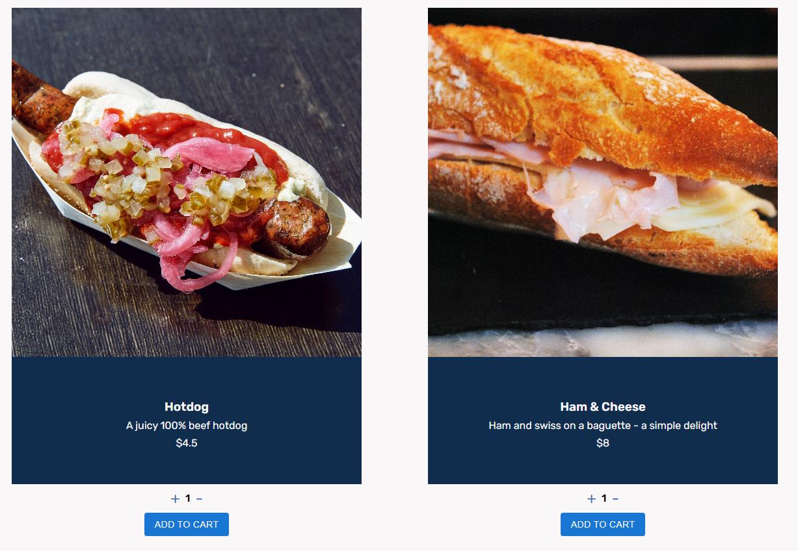

# [Ahmad's Eats](https://ahmads-eats.netlify.app/)

This project was completed as the capstone project for the Full Stack Engineer course on [Codecamey.](https://www.codecademy.com/learn/paths/full-stack-engineer-career-path)

The live project can be **[viewed here.](https://ahmads-eats.netlify.app/)**

Please note that the details of the full stack project are included here, but this repository only includes the front end code. The code for the back end can be [found here.](https://github.com/YSquid/ecomm-REST-api)

  
 
  

---
## Table of Contents
1. [Purpose](#purpose)
2. [Technology Used](#technology-used)
3. [Features](#features)
4. [App Architecture](#app-architecture)
5. [Testing](#testing)
6. [Future Improvement Ideas](#future-improvement-ideas)
7. [Contribute](#contribute)
8. [Acknowledgements](#acknowledgements)
9. [License](#license)

---

## Purpose

The purpose of this project was to test the material covered in [Codecademy Full-Stack Software Engineer Career Path.](https://www.codecademy.com/learn/paths/full-stack-engineer-career-path)

This projected integrated both technical and conceptual knowledge related to modern full stack application development.

Concepts tested include:

- Planning and creating a RESTful API
- Implementing a server with Node.js
- Implementing routing with Express.js
- Creating and interacting with a PostgreSQL database
- User authentication with Passport.js
- Creating a web client with React
- Deploying a full stack application with Netlify
- Continuous integration and continous deployment
---

## Technology Used

**Development:**

- HTML5
- CSS3
- Javascript (ES6)
- ReactJS
- Express.js
- Node.js

**Database**

- PostgreSQL hosted on [Supabase](https://supabase.com/)

**Version Control:**
- Git

**Hosting & CI/CD:**
- GitHub
- Netlify

**Notable Libraries Used**

- Passport.js
- Bcrypt
- Material UI
- React Icons
- React Router
- Servless Http
- @supabase/supabase-js

---

## Features

Note: As this was a project for practice, no actual info is taken that would be needed for shipping in real life (i.e. payment and address info)

- User Registration and Autentication. Implemented with [Passport.js local strategy.](https://www.passportjs.org/packages/passport-local/) Passwords encrypted with [bcrypt.](https://www.npmjs.com/package/bcrypt)
- Browse items, filterable by category
- Add a selected quantity of items to your cart
- View your cart and see a subtotal, and total with tax (calculated based on Saskatchewan tax amounts)
- Checkout your cart
- View your order history

## Deployment

This web-app is deployed on [Netlify](https://www.netlify.com/). The front end is deployed using Netlify's CI/CD integration with GitHub. The back end is also deployed via GitHub CI/CD integration, in the serverless functions style.

## Testing

- This app was tested manually by the author using the Chrome Browser on Windows 10 and on Android (Galaxy S9)
- Layout for the resolutions of the following devices was tested (via Chrome Dev Tools device emulator):
    - iPhone SE
    - iPhone XR
    - iPhone 12 Pro
    - iPad Air
    - iPad Mini
    - Galaxy S8+
    - Galaxy S9+
    - Galaxy S20 Ultra
    - Galaxy A51/71
    - Surface Pro 7
    - Surface Duo
    - Pixel 5

## Future Improvement Ideas

- Implementing third paty OAuth (i.e. Google, Facebook)
- Add ability to change amount of items already in the cart
- Add product details page
- Add a user profile page

## Contribute

If you would like to improve this project, you may submit [a pull request here.](https://github.com/YSquid/ecomm-client/pulls)

If you would like to connect with me you can reach me at:
- Email: [contact@ahmadkariem.com](mailto:contact@ahmadkariem.com)
- LinkedIn: [Ahmad Kariem](https://www.linkedin.com/in/ahmad-kariem/)

## License

[MIT](https://opensource.org/licenses/MIT)

Copyright 2022 Ahmad Kariem

Permission is hereby granted, free of charge, to any person obtaining a copy of this software and associated documentation files (the "Software"), to deal in the Software without restriction, including without limitation the rights to use, copy, modify, merge, publish, distribute, sublicense, and/or sell copies of the Software, and to permit persons to whom the Software is furnished to do so, subject to the following conditions:

The above copyright notice and this permission notice shall be included in all copies or substantial portions of the Software.

THE SOFTWARE IS PROVIDED "AS IS", WITHOUT WARRANTY OF ANY KIND, EXPRESS OR IMPLIED, INCLUDING BUT NOT LIMITED TO THE WARRANTIES OF MERCHANTABILITY, FITNESS FOR A PARTICULAR PURPOSE AND NONINFRINGEMENT. IN NO EVENT SHALL THE AUTHORS OR COPYRIGHT HOLDERS BE LIABLE FOR ANY CLAIM, DAMAGES OR OTHER LIABILITY, WHETHER IN AN ACTION OF CONTRACT, TORT OR OTHERWISE, ARISING FROM, OUT OF OR IN CONNECTION WITH THE SOFTWARE OR THE USE OR OTHER DEALINGS IN THE SOFTWARE.